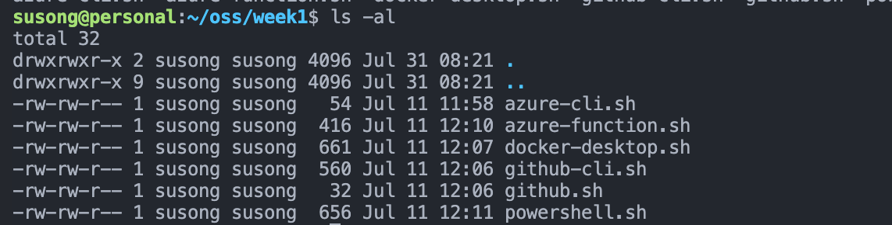
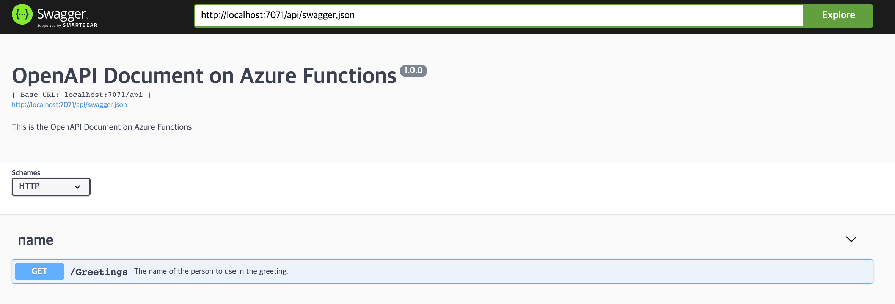
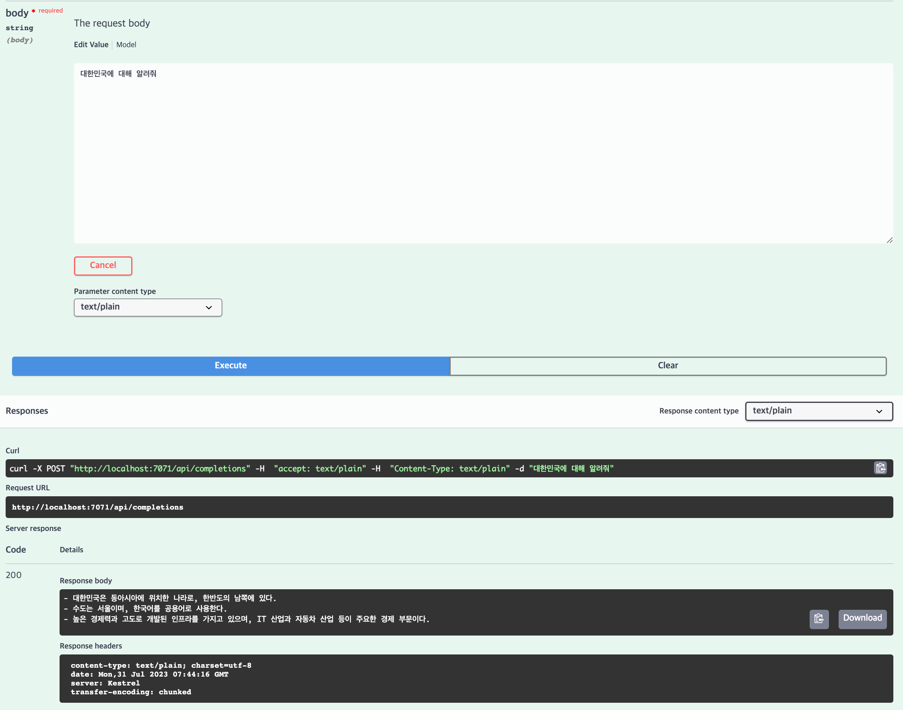

# 프로젝트 개요

이 프로젝트는 3주간의 학습 과정을 통해 Azure Functions과 C#을 이용한 어플리케이션 개발을 진행한 결과물입니다. 각 주차별 학습 내용과 과제를 요약해 보았습니다.

## 1주차

- **학습 내용**: 기본적인 dotnet, Azure Functions, 그리고 C#에 대해서 배웠습니다.
- **라이브러리와 문법**: 필수적인 라이브러리 사용법과, 각각의 역할 그리고 앞으로 사용할 C#에 대한 문법을 배웠습니다.
- **특이사항**: RISC(M1 등 Arm기반 CPU) 사용자는 Azure Function이 지원하지 않으므로 X86기반 커널에서 실시하는 것을 추천합니다. 본인 또한, X86 기반의 Ubuntu 서버를 구해서 해당 서버에서 진행했습니다(Azure).
- **필수 설치파일 sh 관리**: 필요한 라이브러리는 다른 곳에서도 사용할 수 있도록 sh파일로 관리하였습니다.

## 2주차

- **학습 내용**: Dotnet 환경에서 Azure Function을 만들어보는 실습을 진행했습니다.
- **OpenAPI Extension**: 본격적으로 OpenAPI Extension에 대해서 알아보고 실제로 어떻게 작동하는지 확인할 수 있었습니다.
- **비교 학습**: 기본적으로 JS에서 Swagger을 사용할 때와 비슷하지만, 조금 다른 부분에 집중해서 공부했습니다.
- **환경 차이**: C# dotnet 환경과 Dotnet(isolated) 환경 차이에 대해 학습하고, 각각의 방법으로 Azure Function을 만들어봤습니다.

## 3주차

- **학습 내용**: 실제 Azure Function을 이용해서 사용 가능한 어플리케이션을 만들어봤습니다.
- **설명 봇 제작**: 수업 중에는 OPENAI API SDK를 이용하여서 OPENAI(ChatGPT)를 사용하는 설명 봇(3줄 요약)을 만들어봤습니다.
- **C# 환경변수**: C#에서 환경변수는 어떻게 사용되는지 그리고 특히, 패키지 관리에 집중하면서 수업을 들었습니다.
- **과제 내용**: 해당 내용을 SDK를 사용하지 않는 방식으로(날 것의 HTTP Request 제작) 만들어보는 것이 과제였습니다.
- **과제 상세**: CHATGPT를 기반으로 날 것의 HTTP Request를 만들어서 답변 받는 과제를 진행했습니다.
- **에러 핸들링**: 진행 중에 네트워크 에러 가능성, 서버 에러 가능성을 고려한 어플리케이션을 제작하였고, Client 재사용을 고려하여 제작하였습니다.

## 마치며

Azure Functions과 C#을 이용한 서버리스 어플리케이션 개발의 기본을 다지기 위한 훌륭한 기회였습니다. Master 클래스로 진입하게된다면, 이번에 배운 것을 바탕으로 실제 오픈소스에 필요한 것이 무엇인지 알고 기역하겠습니다.
